# Non-Human Identity Management with Akeyless Universal Identity: Beyond Static Credentials

*How dynamic UID tokens and hierarchical management enable secretless non-human identity authentication for automated systems*

---

## Introduction

Non-human identity management has become one of the most critical security challenges facing security teams. Non-human entities—from CI/CD pipelines to microservices—need to authenticate to digital systems just as much as human users do, often more. Yet traditional approaches to managing non human identities remain problematic: static API keys that never rotate, shared credentials across multiple systems, and manual secret distribution that doesn't scale.

Unlike human identities, machine identities operate without direct human oversight, creating unique security challenges for access management. These digital identities require automated processes to perform tasks, access sensitive data, and interact with cloud services while maintaining robust security measures to prevent cyber threats and data breaches.

Enter **Akeyless Universal Identity**, an elegant solution for non-human identity security built around dynamic UID tokens. Unlike traditional approaches that rely on static credentials, Universal Identity provides a secretless token-based system with automatic rotation, hierarchical management, and enterprise-grade lifecycle controls that enhance security while eliminating security gaps.

This isn't just another authentication method—it's a fundamental reimagining of how non-human identity management should work in modern, secretless infrastructure to strengthen security posture and protect critical systems.


*Complete Universal Identity workflow showing dynamic non-human identity management from initial setup through self-rotation*

## What "Secretless" Really Means

Before diving deeper, let's address a common question: "Secretless architecture still uses tokens—aren't those secrets?"

You're absolutely right—UID tokens ARE secrets. But "secretless" doesn't mean "no credentials at all." It means eliminating static, long-lived, manually-managed secrets in favor of dynamic, short-lived, self-managing credentials that reduce security risks and security vulnerabilities.

### Traditional Secrets vs. Secretless Architecture

**Traditional Approach (Static Secrets):**
```bash
# Hardcoded in application config - never changes
API_KEY="ak-12345678-static-forever"
DATABASE_PASSWORD="password123-for-6-months" 
SERVICE_TOKEN="manual-rotation-maybe-never"
```

**Problems:**
- ❌ Static credentials that never change
- ❌ Stored permanently in configuration files
- ❌ Manual rotation (if done at all)
- ❌ Human intervention required for updates
- ❌ High exposure risk (compromised = long-term access to sensitive information)

**Secretless Approach (Universal Identity):**
```bash
# Dynamic, auto-rotating credentials
UID_TOKEN="u-AQAAADwAAAA..." # Rotates every 60 minutes automatically
T_TOKEN="t-874c497cbe4c..."   # Short-lived session token (hours)
```

**Benefits:**
- ✅ Dynamic credentials that auto-rotate
- ✅ Time-limited exposure (60-minute TTL)
- ✅ Self-rotating without human intervention
- ✅ No static secrets in application code
- ✅ Automatic credential proper lifecycle management

### The Hotel Key Card Analogy

Think of traditional secrets like master keys that work forever—if lost or stolen, they pose enormous security risks and require changing all the locks.

Secretless architecture is like hotel key cards that:
- Expire automatically (daily)
- Are replaced without human intervention
- Have limited access permissions scope
- Minimize exposure if compromised

### The Bootstrap Reality

Universal Identity doesn't eliminate the "bootstrap problem"—you need ONE initial UID token to start. But it minimizes the security risks:

1. **Initial Setup**: One UID token required for bootstrap
2. **Self-Management**: Token rotates itself automatically every hour
3. **No Human Intervention**: After setup, zero manual secret management
4. **Limited Blast Radius**: Even if compromised, expires in 60 minutes

"Secretless" = No Static, Long-lived Secrets in Your Infrastructure

## The Secret Zero Problem: Understanding Non-Human Identity Challenges

Before diving into solutions, we must address the fundamental challenge that has plagued non-human identity security for years: the secret zero problem.

### What is Secret Zero?

Secret zero is the paradox of needing initial credentials to securely retrieve credentials. It's the bootstrap problem that every automated process faces: *How do you provide the first secret without creating security vulnerabilities?*

Consider this scenario:
- Your application needs database credentials from a secrets management system
- But how does your application authenticate to the secrets management system?
- You need some initial credential (secret zero) to get other secrets
- This creates the bootstrap dilemma for managing service accounts

### The Environment Divide

**Cloud-Native Environments:**
Cloud services provide elegant solutions to secret zero:
- **AWS**: IAM roles with instance profiles
- **Azure**: Managed identities for compute resources  
- **GCP**: Service accounts with metadata service
- **Kubernetes**: Service account tokens with projected volumes

These platforms can cryptographically verify machine identities without pre-shared secrets.

**Non-Cloud Environments:**
Traditional environments have no native identity mechanisms:
- **VMware VMs**: No built-in identity service
- **Physical servers**: No cryptographic identity foundation
- **Legacy systems**: Manual credential distribution required
- **On-premises infrastructure**: No metadata services available

The Scale: An estimated 70% of enterprise workloads still run in these cloud environments that lack native identity capabilities, making them prime targets for cyber threats.

### Current Approaches Fall Short

**Traditional Solutions Still Require Shared Secrets:**

- **HashiCorp AppRole**: Requires a shared `secret_id` distributed to machines
- **Configuration Files**: Hardcoded credentials stored on disk
- **Environment Variables**: Static secrets in container/VM configuration
- **Manual Distribution**: Human users copying credentials

The Problem: All these approaches just move the secret zero problem - they don't solve it. You still need to securely provide that initial shared secret, creating security gaps and access management challenges.

### How Universal Identity Solves Secret Zero

**Akeyless Universal Identity** transforms the secret zero problem through:

1. **Dynamic Credential Management**: Replaces static, long-lived secrets with self-rotating UID tokens that minimize exposure windows
2. **Universal Application**: Works across ALL environments - cloud, VMware, physical servers, legacy systems
3. **Simplified Bootstrap Process**: Reduces secret zero to a single, manageable credential that auto-rotates every 60 minutes
4. **Automated Lifecycle Management**: Eliminates manual credential distribution and rotation processes

The Key Insight: Instead of trying to solve "how to securely distribute secret zero," Universal Identity asks "how can we minimize secret zero to a single, self-managing credential?"

## The Non-Human Identity Challenge

### Beyond Human Identity Management

While the industry has made significant strides in human identity management with solutions like OAuth, SAML, and multi factor authentication, non-human identity management has lagged behind. Automated processes have different requirements than human users:

- **24/7 Operation**: No human intervention for credential refresh
- **Scale**: Thousands of services requiring secretless authentication
- **Automation**: Integration with CI/CD and orchestration systems
- **Security**: Secretless access without sharing credentials across environments
- **Auditability**: Clear attribution and access controls logging

### Traditional Approaches Fall Short

Most organizations rely on problematic approaches for non-human access that compromise secretless architecture goals and create security vulnerabilities:

#### API Keys
- **Never rotate**: API keys often remain static for months or years
- **Over-privileged**: Broad access permissions to avoid management complexity  
- **Shared across systems**: Same key used in multiple environments
- **No expiration**: Keys remain valid indefinitely
- **Secret sprawl**: Credentials stored in configuration files

#### Service Accounts
- **Manual rotation**: Requires coordinated updates across systems
- **Credential distribution**: How do you securely provide initial credentials?
- **Break-glass scenarios**: No fallback when credentials are compromised
- **Static secrets**: Contradicts secretless architecture principles

#### Certificate-Based Authentication
- **PKI complexity**: Requires complex certificate authority management
- **Certificate lifecycle**: Manual renewal and distribution processes
- **Revocation challenges**: Difficult to revoke compromised certificates
- **Secret storage**: Private keys must be stored securely

The result? Most organizations live with static credentials, accepting the security risks because the operational overhead of proper rotation is too high. This approach fundamentally contradicts secretless architecture principles and leaves organizations vulnerable to supply chain attacks.

## Introducing Akeyless Universal Identity

### The Secretless Token-Based Approach

Akeyless Universal Identity enables true secretless non-human identity security through a sophisticated token-based system that addresses unique security challenges:

- **UID Tokens**: Non-human entities identity credentials that can be rotated automatically
- **T-Tokens**: Short-lived tokens for actual API operations
- **Token Hierarchies**: Parent-child relationships for organized access controls
- **Automatic Lifecycle Management**: Built-in rotation and expiration handling
- **Secretless Operations**: No static credentials stored on systems

The key insight is separation of concerns: UID tokens represent identity, t-tokens represent sessions. This separation enables powerful secretless management capabilities while maintaining robust security measures and preventing unauthorized access.

### Core Components

#### Universal Identity Authentication Methods
These are the foundation—authentication methods that can generate UID tokens for non-human entities. Unlike traditional authentication methods that require static credentials, Universal Identity methods generate dynamic tokens for secretless operations.

```bash
# Create a Universal Identity authentication method
akeyless auth-method create universal-identity \
    --name "/production/microservices" \
    --ttl 60 \
    --jwt-ttl 720
```

#### UID Token Generation and Management
UID tokens are the non-human entities' "identity card"—they can be rotated without changing the underlying identity, enabling true secretless architecture.

```bash
# Generate initial UID token
akeyless uid-generate-token --auth-method-name "/production/microservices"

# Rotate token (resets TTL, invalidates old token)
akeyless uid-rotate-token --uid-token "u-XXXXXXXX"

# Create child tokens for specific services
akeyless uid-create-child-token --uid-token "u-XXXXXXXX" --child-ttl 30
```

#### Best Practice: Secretless UID → T-Token Workflow
The recommended secretless pattern is to exchange UID tokens for t-tokens for actual operations, implementing least privilege access:

```bash
# Non-human entity authenticates with UID token to get t-token
akeyless auth --access-id "p-xxxx" \
              --access-type universal_identity \
              --uid_token "u-XXXXXXXX"

# Use t-token for secret retrieval
akeyless get-secret-value --name "/production/database-creds" --token "t-XXXXXXXX"
```

This secretless pattern provides several benefits for enterprise security:
- **Performance**: T-tokens are optimized for high-frequency operations
- **Security**: Short-lived t-tokens minimize exposure window
- **Auditability**: Clear separation between identity and session operations
- **No static secrets**: All credentials are dynamic and rotating

## Access Management for Non-Human Identities

### Role-Based Access Control for Machine Identities

Effective access management for machine identities requires implementing role based access control (RBAC) and least privilege principles. Universal Identity provides hierarchical token management that enables organized access controls:

```
Parent UID Token (Application)
├── Child Token (Database Service)
├── Child Token (Cache Service)
└── Child Token (Notification Service)
    ├── Grandchild Token (Email Provider)
    └── Grandchild Token (SMS Provider)
```

### Practical Hierarchy Examples

#### Environment-Based Hierarchy
```bash
# Organization-level parent token
ORG_TOKEN="u-org-level-token"

# Environment-specific child tokens with least privilege
DEV_TOKEN=$(akeyless uid-create-child-token --uid-token "$ORG_TOKEN" --child-ttl 480)
STAGING_TOKEN=$(akeyless uid-create-child-token --uid-token "$ORG_TOKEN" --child-ttl 240)
PROD_TOKEN=$(akeyless uid-create-child-token --uid-token "$ORG_TOKEN" --child-ttl 60)
```



```mermaid
graph TD
    A["🏢 Organization Token<br/>TTL: 60 min<br/>(Parent)"] --> B["🧪 Development Token<br/>TTL: 480 min<br/>(8 hours)"]
    A --> C["🚀 Staging Token<br/>TTL: 240 min<br/>(4 hours)"]
    A --> D["🔒 Production Token<br/>TTL: 60 min<br/>(1 hour)"]
    
    style A fill:#0277bd,stroke:#01579b,stroke-width:2px,color:#ffffff
    style B fill:#2e7d32,stroke:#1b5e20,stroke-width:2px,color:#ffffff
    style C fill:#f57c00,stroke:#e65100,stroke-width:2px,color:#ffffff
    style D fill:#c62828,stroke:#b71c1c,stroke-width:2px,color:#ffffff
```

#### Service-Based Hierarchy
```bash
# Main application token
APP_TOKEN="u-main-app-token"

# Service-specific child tokens implementing only the permissions needed
DB_TOKEN=$(akeyless uid-create-child-token --uid-token "$APP_TOKEN" --child-ttl 60)
API_TOKEN=$(akeyless uid-create-child-token --uid-token "$APP_TOKEN" --child-ttl 30)
WORKER_TOKEN=$(akeyless uid-create-child-token --uid-token "$APP_TOKEN" --child-ttl 120)
```



```mermaid
graph TD
    A["🚀 Main Application Token<br/>TTL: 60 min<br/>(Parent)"] --> B["🗄️ Database Service<br/>TTL: 60 min<br/>(High Security)"]
    A --> C["🌐 API Service<br/>TTL: 30 min<br/>(Shortest Exposure)"]
    A --> D["⚙️ Worker Service<br/>TTL: 120 min<br/>(Long-running Tasks)"]
    
    style A fill:#0277bd,stroke:#01579b,stroke-width:2px,color:#ffffff
    style B fill:#2e7d32,stroke:#1b5e20,stroke-width:2px,color:#ffffff
    style C fill:#c62828,stroke:#b71c1c,stroke-width:2px,color:#ffffff
    style D fill:#6a1b9a,stroke:#4a148c,stroke-width:2px,color:#ffffff
```

### Access Controls and Revocation Scenarios

The hierarchical structure enables powerful revocation scenarios for secretless architecture and risk management:

```bash
# Revoke only a specific service
akeyless uid-revoke-token --revoke-token "$DB_TOKEN" \
                          --revoke-type revokeSelf \
                          --auth-method-name "/production/microservices"

# Revoke service and all its child tokens
akeyless uid-revoke-token --revoke-token "$API_TOKEN" \
                          --revoke-type revokeAll \
                          --auth-method-name "/production/microservices"

# Emergency revocation of entire application tree
akeyless uid-revoke-token --revoke-token "$APP_TOKEN" \
                          --revoke-type revokeAll \
                          --auth-method-name "/production/microservices"
```

## Implementation Patterns

### Microservices Architecture

In microservices environments, each service can have its own child token for secretless authentication, ensuring only authorized individuals or services can access sensitive data:

```python
# Example Python microservice integration
import os
import subprocess
import json
from datetime import datetime, timedelta

class AkeylessClient:
    def __init__(self, auth_method, uid_token_file):
        self.auth_method = auth_method
        self.uid_token_file = uid_token_file
        self._cached_t_token = None
        self._token_expiry = None
    
    def get_t_token(self):
        # Check if cached token is still valid
        if (self._cached_t_token and self._token_expiry and 
            datetime.now() < self._token_expiry - timedelta(minutes=5)):
            return self._cached_t_token
        
        # Read UID token from secure storage
        with open(self.uid_token_file, 'r') as f:
            content = f.read().strip()
            # Handle demo-tokens format (key=value pairs)
            if '=' in content:
                for line in content.split('\n'):
                    if line.startswith('UID_TOKEN='):
                        uid_token = line.split('=', 1)[1]
                        break
            else:
                uid_token = content
        
        # Exchange UID token for t-token (secretless pattern)
        result = subprocess.run([
            'akeyless', 'auth',
            '--access-id', self.auth_method,
            '--access-type', 'universal_identity',
            '--uid_token', uid_token
        ], capture_output=True, text=True, check=True)
        
        # Parse t-token from CLI output
        lines = result.stdout.split('\n')
        for line in lines:
            if 'token' in line.lower() and 't-' in line:
                import re
                match = re.search(r't-[a-zA-Z0-9]+', line)
                if match:
                    self._cached_t_token = match.group(0)
                    self._token_expiry = datetime.now() + timedelta(hours=1)
                    break
        
        return self._cached_t_token
    
    def get_secret(self, secret_name):
        t_token = self.get_t_token()
        
        result = subprocess.run([
            'akeyless', 'get-secret-value',
            '--name', secret_name,
            '--token', t_token
        ], capture_output=True, text=True, check=True)
        
        return result.stdout.strip()

# Usage in microservice (secretless authentication)
client = AkeylessClient("p-xxxx", "./tokens/demo-tokens")
db_password = client.get_secret("/demo/database-config")
```

### Automated Token Rotation

Production systems should implement automated token rotation for secretless operations and proper lifecycle management:

```bash
#!/bin/bash
# Production token rotation script

TOKEN_FILE="/secure/akeyless-token"
LOG_FILE="/var/log/akeyless-rotation.log"

# Read current token
CURRENT_TOKEN=$(cat "$TOKEN_FILE")

# Rotate token (secretless self-rotation)
NEW_TOKEN_OUTPUT=$(akeyless uid-rotate-token --uid-token "$CURRENT_TOKEN")
NEW_TOKEN=$(echo "$NEW_TOKEN_OUTPUT" | grep -E "(ROTATED TOKEN|Token):" | sed 's/.*\[//' | sed 's/\].*//')

if [[ -n "$NEW_TOKEN" && "$NEW_TOKEN" != "null" ]]; then
    # Save new token securely
    echo "$NEW_TOKEN" > "$TOKEN_FILE"
    chmod 600 "$TOKEN_FILE"
    
    echo "$(date): Secretless token rotation successful" >> "$LOG_FILE"
else
    echo "$(date): Token rotation failed!" >> "$LOG_FILE"
    exit 1
fi
```

Add to crontab for hourly rotation:
```bash
0 * * * * /path/to/rotate-token.sh
```

## Digital Identities and Security Benefits

### Eliminates Static Credentials

| Feature | Universal Identity | Traditional Approaches |
|---------|-------------------|------------------------|
| **Rotation** | ✅ Automatic with TTL reset | ❌ Manual process |
| **Hierarchical Access** | ✅ Parent-child relationships | ❌ Flat structure |
| **Auditability** | ✅ Complete token lifecycle logs | ❌ Limited visibility |
| **Revocation** | ✅ Immediate, granular control | ❌ System-wide impact |
| **TTL Management** | ✅ Built-in expiration | ❌ No expiration |
| **Child Tokens** | ✅ Service isolation | ❌ Shared credentials |
| **Secretless Operations** | ✅ No static secrets | ❌ Static credentials required |

## Cloud Services and Deployment Strategies

### Phased Rollout Approach for Cloud Environments

#### Phase 1: Non-Critical Services
- Start with development and staging environments
- Implement secretless authentication for non-critical background services
- Validate rotation and monitoring processes
- Control access to critical resources gradually

#### Phase 2: Critical Services
- Migrate critical production services to secretless authentication
- Implement comprehensive monitoring
- Establish operational procedures
- Ensure compliance with security policies

#### Phase 3: Enterprise Integration
- Integrate with existing identity management
- Implement organization-wide secretless policies
- Scale to complete infrastructure
- Strengthen security across all digital systems

### Monitoring and Alerting

Essential monitoring for secretless Universal Identity to gain complete visibility:

```bash
# Token health monitoring
akeyless uid-list-children --uid-token "$PARENT_TOKEN"

# Failed authentication monitoring
grep "authentication failed" /var/log/akeyless-auth.log | tail -n 100

# Rotation monitoring with simple test
if akeyless uid-list-children --uid-token "$TOKEN" > /dev/null 2>&1; then
    echo "Token is valid"
else
    echo "ALERT: Token may be expired or invalid"
fi
```

### Security Best Practices

1. **Secure Token Storage**: Store UID tokens with restricted file permissions (600)
2. **Regular Rotation**: Implement automated hourly rotation for secretless operations
3. **Principle of Least Privilege**: Create child tokens with minimal necessary TTL
4. **Monitoring**: Alert on authentication failures and rotation issues
5. **Emergency Procedures**: Plan for token revocation scenarios
6. **Secretless Design**: Eliminate all static credentials from systems

## Live Demo: Universal Identity in Action

The best way to understand how Universal Identity solves the secret zero problem is to see it in action. Our comprehensive **interactive demo** showcases how non-human identity management transforms from a security vulnerability into a competitive advantage through realistic persona separation.

### Interactive Demo Experience

Run our interactive demo to experience the complete workflow:

```bash
./start.sh
```

**Interactive Demo Experience**: Run `./start.sh` and choose from 7 options:
- **🧑‍💼 Admin Setup**: Initial environment and token generation
- **👷 Platform Engineer Deployment**: Deploy tokens to application services
- **🚀 Application Service Operations**: Autonomous operations with rotation
- **🌳 Hierarchical Token Management**: Parent-child token relationships
- **🐍 Python Integration**: Real-world secretless authentication
- **📊 Show Workflow Status**: Monitor current workflow state
- **🚪 Exit**: Complete demo session

### Demo Environment Setup

Our demo simulates a real-world non-human identity security environment where:
- Application services need to authenticate without pre-shared secrets
- Applications require database credentials and API access  
- Token lifecycle management must be automated
- Hierarchical access controls reflect microservice architecture

**Key Point**: While we demonstrate using Akeyless CLI for clarity, the same principles apply to containerized applications, Kubernetes pods, microservices, and any automated processes requiring non-human identity management.

### Three-Persona Workflow Architecture


### Scenario 1: Complete Three-Persona Workflow

**The Challenge**: How does a new application service establish identity and access sensitive data without static credentials while following realistic organizational roles?

**Interactive Demo Path**: Choose **Option 1: Complete Three-Persona Workflow** from `./start.sh` menu

**What You'll Experience**:

**🧑‍💼 Admin Persona (Steps 1-3)** - Run: `./scripts/admin-setup.sh`
1. **UID Authentication Method Creation**: 
   ```bash
   akeyless auth-method create universal-identity \
       --name "/demo/uid-non-human-auth" \
       --ttl 60 \
       --jwt-ttl 720
   ```
   - Creates dynamic non-human identity infrastructure
   - No shared secrets required for this process
   - Solves the secret zero problem at the organizational level

2. **Initial Token Generation**:
   ```bash
   akeyless uid-generate-token --auth-method-name "/demo/uid-non-human-auth"
   ```
   - Generates bootstrap token for application service
   - One-time provisioning activity
   - Admin maintains policy control

3. **Token Provisioning**:
   - Creates `./tokens/client-tokens` file for Platform Engineer
   - Secure handoff of initial credentials

**👷 Platform Engineer Persona (Deployment)** - Run: `./scripts/platform-deploy.sh`
4. **Service Deployment**:
   - Deploys admin-generated tokens to application services
   - Creates `./tokens/application-service-token` for autonomous operations
   - Sets up automated rotation infrastructure with `application-service-rotate.sh`
   - Configures cron job template for hourly rotation

**🚀 Application Service Persona (Steps 4-9)** - Run: `./scenarios/client-workflow.sh` (includes automatic token rotation)
5. **UID → T-Token Exchange**:
   ```bash
   akeyless auth --access-id "$ACCESS_ID" \
                 --access-type universal_identity \
                 --uid_token "$UID_TOKEN"
   ```
   - Exchanges long-lived identity (UID) for short-lived session (T-token)
   - Best practice: separation of identity vs. operations
   - No static credentials stored anywhere

6. **Database Secret Retrieval**:
   ```bash
   akeyless get-secret-value --name "/demo/database-config" \
                             --token "$T_TOKEN"
   ```
   - Uses T-token for actual database secret access
   - Retrieves real database configuration JSON
   - Demonstrates end-to-end secretless application authentication

7. **Self-Rotation Process**:
   ```bash
   akeyless uid-rotate-token --uid-token "$UID_TOKEN"
   ```
   - Zero human intervention required
   - Old token immediately invalidated
   - New token issued with reset TTL
   - Automatic update of stored credentials in token file

8. **Validation of New Token**:
   - Authenticate with new token successfully
   - Demonstrate old token is rejected
   - Show seamless operation continuity

**Demo Outcome**: A complete non-human identity authentication flow with realistic persona separation and zero static credentials hardcoded anywhere in the system.

### Scenario 2: Token Rotation Demo

**The Challenge**: How do application services maintain security with automatic credential lifecycle management?

**Interactive Demo Path**: Choose **Option 6: Token Rotation Demo** from `./start.sh` menu

**What You'll Experience** - Run: `./scenarios/client-workflow.sh` (includes automatic token rotation)

1. **Current Token Status**:
   - View token tree structure and TTL information
   - See expiration times (60-minute default TTL)
   - Understand the limited exposure window

2. **Self-Rotation Process**:
   ```bash
   akeyless uid-rotate-token --uid-token "$CURRENT_TOKEN"
   ```
   - Zero human intervention required
   - Old token immediately invalidated
   - New token issued with reset TTL
   - Automatic update of stored credentials

3. **Validation of New Token**:
   - Authenticate with new token successfully
   - Demonstrate old token is rejected (401 errors)
   - Show seamless operation continuity

**Demo Outcome**: Application services can self-manage their credentials automatically, eliminating the operational overhead of manual rotation while maintaining robust security measures.

### Scenario 3: Hierarchical Token Management

**The Challenge**: How do you organize non-human identity access across microservices, containers, and service components with proper security controls?

**Interactive Demo Path**: Choose **Option 7: Hierarchical Token Management** from `./start.sh` menu

**What You'll Experience** - Run: `./scenarios/child-tokens.sh`

1. **Parent-Child Token Creation for Microservices**:
   ```bash
   # Create microservice-specific child tokens
   akeyless uid-create-child-token --uid-token "$PARENT_TOKEN" --child-ttl 30  # Database service
   akeyless uid-create-child-token --uid-token "$PARENT_TOKEN" --child-ttl 60  # API gateway
   ```
   - Different TTLs for different microservice risk levels
   - Service isolation through token hierarchy
   - Microservice architecture reflected in access

2. **Token Tree Visualization**:
   ```bash
   akeyless uid-list-children --uid-token "$PARENT_TOKEN"
   ```
   - See complete microservice token family tree
   - Understand inheritance and relationships
   - View individual TTLs and expiration times

3. **Granular Revocation for Microservices**:
   ```bash
   # Revoke individual microservice
   akeyless uid-revoke-token --revoke-token "$DATABASE_SERVICE_TOKEN" \
                             --revoke-type revokeSelf \
                             --auth-method-name "$AUTH_METHOD"
   
   # Revoke entire service tree
   akeyless uid-revoke-token --revoke-token "$PARENT_TOKEN" \
                             --revoke-type revokeAll \
                             --auth-method-name "$AUTH_METHOD"
   ```
   - Targeted revocation vs. cascading revocation
   - Emergency response capabilities for microservices
   - Precise access controls for container environments

**Demo Outcome**: Application services can be organized hierarchically to match your microservice architecture, providing both flexibility and control while preventing unauthorized access.

### Scenario 4: Python Integration Example

**The Challenge**: How does Universal Identity integrate into real-world applications and programming languages?

**Interactive Demo Path**: Choose **Option 8: Python Integration Example** from `./start.sh` menu

**What You'll Experience** - Run: `python3 ./examples/machine-auth.py`

Beyond the CLI demonstrations, our demo includes a complete Python application showing how non-human identity integrates into real applications and microservice architectures.

**What You'll See**:

1. **Secretless Python Application Service**:
   ```python
   # Load UID token from secure storage (no hardcoded credentials)
   client = AkeylessClient(
       auth_method=access_id,
       token_file="./tokens/application-service-token"
   )
   
   # Automatic UID → T-token exchange
   secret = client.get_secret("/demo/database-config")
   ```

2. **Database Service Integration**:
   ```python
   # Retrieve database credentials using secretless authentication
   db_config = client.get_secret("/demo/database-config")
   config = json.loads(db_config)
   
   # Use credentials for actual database connection
   db_service = DatabaseService(client)
   db_service.connect_to_database()
   ```

3. **Automatic Token Management**:
   ```python
   # Token rotation handled transparently
   if client.rotate_uid_token():
       print("✅ UID token rotated successfully (secretless self-rotation)")
   
   # Child token creation for microservice isolation
   child_token = client.create_child_token(ttl_minutes=30)
   ```

**Key Insights from Python Demo**:
- **No Static Credentials**: Application service code contains zero hardcoded secrets
- **Transparent Operation**: Developers don't need to manage token lifecycle
- **Production Ready**: Complete error handling and logging
- **Language Agnostic**: Same patterns work in Java, Node.js, Go, etc.

**Demo Outcome**: Real-world integration patterns that developers can immediately implement in their applications.

### Interactive Demo Summary

**Getting Started**: Simply run `./start.sh` and choose your learning path:

1. **🎯 Complete Workflow** (Recommended): Experience all personas automatically
2. **🎭 Individual Scenarios**: Focus on specific aspects:
   - Admin setup and token generation
   - Platform Engineer deployment and automation
   - Application Service autonomous operations  
   - Token rotation demonstrations
   - Hierarchical management
   - Python integration

**Demo Architecture and Real-World Applicability**:

1. **Microservice Environment Simulation**: While using CLI for clarity, the token management patterns directly apply to containerized microservices that lack native identity
2. **Container/Kubernetes Ready**: Same UID token approach works in containerized environments
3. **Legacy System Compatible**: Physical servers and traditional infrastructure can use identical patterns
4. **CI/CD Integration**: Pipeline authentication follows the same UID → T-token flow
5. **Production Ready**: Python example shows real application integration

**Key Demo Takeaways**:

1. **Secret Zero Elimination**: No pre-shared secrets required for application service establishment
2. **Microservice Ready**: Solutions work in environments without native identity (like containerized applications)
3. **Operational Excellence**: Zero human intervention after initial setup
4. **Enterprise Scale**: Hierarchical management supports microservice complexity
5. **Developer Friendly**: Simple integration patterns for any programming language
6. **Interactive Learning**: Menu-driven experience lets you explore at your own pace

The interactive demo proves that non-human identity management doesn't have to choose between security and simplicity—Universal Identity delivers both while strengthening security posture through realistic persona separation that matches real organizational workflows.

## Frequently Asked Questions

### What is a non-human identity?

A non-human identity is a digital identity assigned to machines, applications, services, or automated systems that need to authenticate and access resources without direct human intervention. Unlike human identities, these identities are used by automated processes such as CI/CD pipelines, microservices, containers, virtual machines, and robotic process automation systems to perform tasks and access sensitive data.

### What is the difference between human identity and non-human identity?

Human identities are tied to actual people and typically use interactive authentication methods like passwords, multi factor authentication, and single sign on. Non-human identities belong to digital systems and automated processes that operate without direct human oversight. Key differences include:

- **Human identities**: Interactive authentication, MFA, password resets, user sessions
- **Non-human identities**: Programmatic authentication, API keys, certificates, service accounts, continuous operation

### What are non-human entities?

Non-human entities include any digital systems or automated processes that require authentication, such as:

- **Microservices** and containerized applications
- **CI/CD pipelines** and build systems  
- **Cloud services** and serverless functions
- **Virtual machines** and physical servers
- **IoT devices** and edge computing systems
- **Robotic process automation** (RPA) bots
- **Service accounts** and system processes

### What is secretless authentication?

Secretless authentication is a security approach that eliminates static, long-lived credentials in favor of dynamic, automatically-rotating tokens. Instead of hardcoding API keys or passwords, secretless systems use short-lived tokens that are automatically generated, rotated, and revoked. Universal Identity implements secretless authentication through UID tokens that rotate every 60 minutes, eliminating security vulnerabilities associated with static credentials.

### What is non-human identity security?

Non-human identity security refers to the specialized security policies, access controls, and management practices needed to protect machine identities and automated processes. This includes implementing least privilege access, proper lifecycle management, automated rotation, hierarchical access management, and monitoring to prevent unauthorized access and data breaches. Unlike traditional security focused on human users, non-human identity security addresses unique security challenges of 24/7 automated systems.

### What is machine identity management?

Machine identity management is the practice of managing digital identities for machines, devices, and automated processes. This involves creating, provisioning, rotating, and revoking credentials for non-human entities. Universal Identity provides advanced machine identity management through hierarchical token structures, automatic rotation, and role based access control that ensures only authorized individuals and systems can gain access to critical resources.

### What is the difference between non-human identity and machine identity?

The terms non-human identity and machine identity are often used interchangeably, but there are subtle distinctions:

- **Machine identity**: Typically refers to physical devices, servers, and infrastructure components
- **Non-human identity**: Broader term encompassing machines, applications, service accounts, automated processes, and any digital entity that operates without human interaction

Both require similar security controls and access management approaches, including dynamic authentication, proper lifecycle management, and robust security measures to prevent cyber threats.

## Cyber Threats and Future Security Strategies

### Industry Trends

The shift toward secretless Universal Identity represents broader industry trends in enterprise security:

- **Zero Trust Architecture**: Continuous verification rather than perimeter security
- **Ephemeral Infrastructure**: Short-lived resources requiring dynamic authentication
- **DevSecOps Integration**: Security embedded in development workflows
- **Compliance Requirements**: Audit trails and access governance
- **Secretless Operations**: Elimination of static credentials

### Akeyless Universal Identity Advantages

- **Secretless design**: Built for modern, dynamic infrastructure
- **Hierarchical management**: Organizational structure reflected in access controls
- **Automatic lifecycle management**: Reduces operational overhead
- **Enterprise integration**: Works with existing identity systems
- **Non-human focused**: Purpose-built for automated processes

## Conclusion

Non-human identity management doesn't have to be a choice between security and operational simplicity. Akeyless Universal Identity provides a sophisticated yet practical secretless solution that scales from simple microservices to complex enterprise security environments while addressing unique security challenges.

**Key takeaways:**

- UID tokens enable secretless architecture through automatic rotation and proper lifecycle management
- Hierarchical token structures enable organized access controls that reflects your infrastructure  
- The UID → T-token pattern provides optimal performance and security for secretless operations
- Production deployment is achievable through phased rollout and proper monitoring
- Robust security measures protect against cyber threats and data breaches

The future of non-human identity is dynamic, hierarchical, automated, and secretless. Organizations implementing Universal Identity today are building the foundation for tomorrow's security architecture while ensuring only authorized individuals and systems can gain access to critical resources.

### Ready to Transform Your Non-Human Identity Management?

**Start experimenting**: Try our [interactive demo](demo/) using `./start.sh` - choose complete workflow or individual personas
**Learn more**: Explore our [implementation examples](demo/examples/) for your technology stack  
**Get started**: Contact the Akeyless team to discuss your non-human identity security requirements

**Interactive Demo Experience**: Run `./start.sh` and choose from 7 options:
- **🧑‍💼 Admin Setup**: Initial environment and token generation
- **👷 Platform Engineer Deployment**: Deploy tokens to application services
- **🚀 Application Service Operations**: Autonomous operations with rotation
- **🌳 Hierarchical Token Management**: Parent-child token relationships
- **🐍 Python Integration**: Real-world secretless authentication
- **📊 Show Workflow Status**: Monitor current workflow state
- **🚪 Exit**: Complete demo session

Non-human identity management is evolving toward secretless architecture. The question isn't whether to modernize—it's how quickly you can begin strengthening security and eliminating security gaps.

---

*This post demonstrates the power of secretless non-human identity. Universal Identity represents the next generation of automated processes authentication, purpose-built for modern infrastructure demands and enterprise security requirements.* 