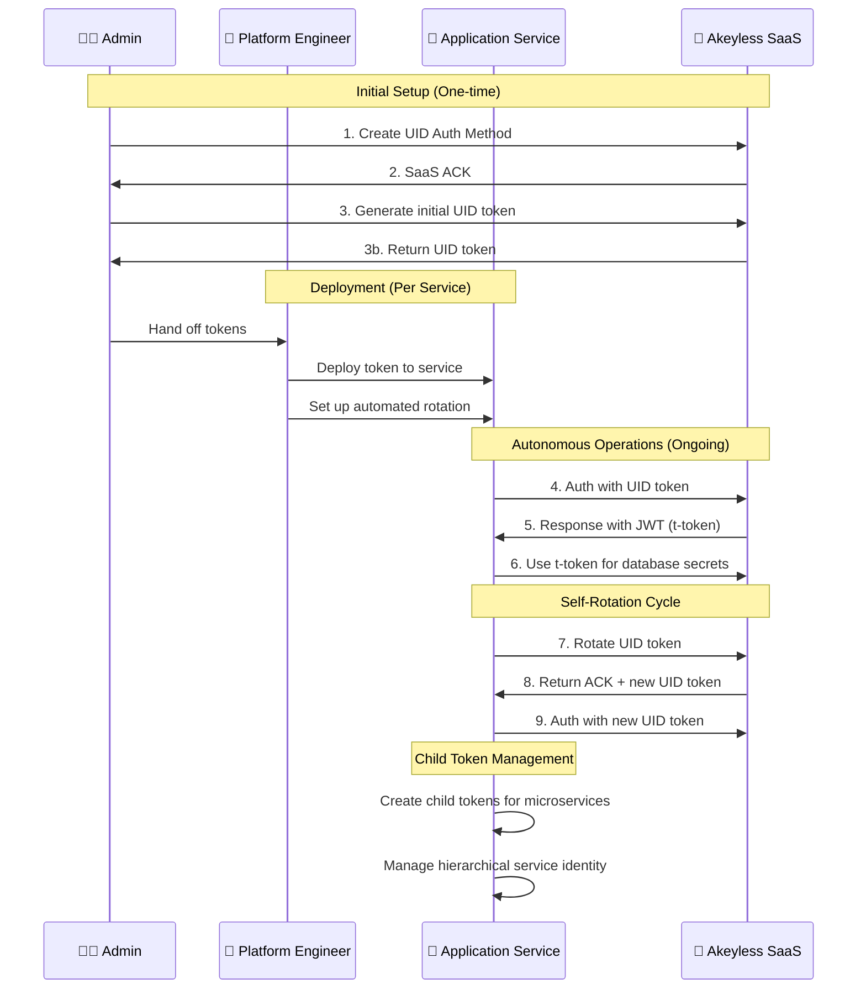

# Akeyless Universal Identity Demo

This directory contains hands-on demonstrations of Universal Identity token management capabilities following the **realistic workflow diagram personas**.

## 🎭 Persona Workflow Diagram



## 🚀 Quick Start: Persona-Based Workflow

### 🎬 Using start.sh (Recommended)
```bash
# Run the interactive demo menu
./start.sh
```

The interactive script provides:
- **🎯 Complete Three-Persona Workflow**: Automated progression through all personas
- **🎭 Individual Persona Selection**: Choose specific steps to run
- **🐍 Python Integration Example**: Real-world secretless authentication demo
- **📊 Real-time Status Tracking**: See which components are complete
- **⚠️ Prerequisites Validation**: Checks environment variables
- **🔄 Smart Workflow Management**: Skips completed steps, enforces dependencies
- **🌈 Color-coded Interface**: Easy-to-follow visual experience

**Menu Options:**
1. **Complete Workflow** (Recommended for first-time users)
2. **Individual Steps** (For learning specific personas)
3. **Advanced Features** (Token rotation, hierarchical management, Python integration)
4. **Status Monitoring** (Check current workflow state)

### 🧑‍💼 Admin Persona (Steps 1-3)
```bash
# Admin sets up environment and provisions application service
./scripts/admin-setup.sh
```

### 👷 Platform Engineer Persona (Deployment)  
```bash
# Platform Engineer deploys to application services and sets up automation
./scripts/platform-deploy.sh
```

### 🚀 Application Service Persona (Steps 4-9)  
```bash
# Application Service uses deployed token for autonomous operations
./scenarios/client-workflow.sh
```

### 🔄 Additional Scenarios
```bash
# Explore hierarchical token management
./scenarios/child-tokens.sh

# Python integration example (secretless authentication)
python3 ./examples/machine-auth.py
```

### 🔄 Legacy Demo (All-in-One - Educational Only)
```bash
# Mixed admin/client operations for learning purposes
# Note: basic-workflow.sh and setup-demo-environment.sh have been removed
# Use start.sh for the complete guided three-persona workflow
./start.sh
```

## 📋 Workflow Diagram Alignment

Our demo now properly follows the workflow diagram personas:

| Step | Persona | Action | Demo Script |
|------|---------|--------|-------------|
| 1-2 | 🧑‍💼 Admin | Creates UID Auth method + Akeyless SaaS Ack | `admin-setup.sh` |
| 3 | 🧑‍💼 Admin | Generates initial UID token & loads in application | `admin-setup.sh` |
| Deploy | 👷 Platform Engineer | Deploys token to application service + sets up automation | `platform-deploy.sh` |
| 4 | 🚀 Application Service | Runs auth command using UID init token | `client-workflow.sh` |
| 5 | 🏢 SaaS | Response with JWT (t-token) | `client-workflow.sh` |
| 6 | 🚀 Application Service | Runs commands using t-token | `client-workflow.sh` |
| 7 | 🚀 Application Service | Rotates UID using u-token | `client-workflow.sh` |
| 8 | 🏢 SaaS | Returns ACK + new u-token | `client-workflow.sh` |
| 9 | 🚀 Application Service | Runs auth command with new u-token | `client-workflow.sh` |

## 📁 Demo Structure

```
demo/
├── scripts/                       # Human persona operations
│   ├── admin-setup.sh              # 🧑‍💼 Admin persona (steps 1-3)
│   ├── platform-deploy.sh          # 👷 Platform Engineer (deployment)
│   ├── application-service-rotate.sh # 🚀 Auto-generated by platform-deploy.sh
│   └── (rotation scripts removed - using application-service-rotate.sh)
├── scenarios/                     # Application Service operations
│   ├── client-workflow.sh          # 🚀 Application Service persona with rotation (steps 4-9)
│   └── child-tokens.sh            # 🚀 Application Service hierarchical management
├── tokens/                        # Token storage
│   ├── client-tokens               # 🧑‍💼 Admin-generated tokens
│   ├── application-service-token   # 👷 Platform Engineer deployed tokens
│   └── demo-tokens                # LEGACY: Mixed-persona storage
├── logs/                          # Application Service logs
│   └── rotation.log               # Automated rotation logging
├── start.sh                       # 🎬 Interactive demo entry point
└── examples/                      # Real-world integration examples
    └── machine-auth.py            # 🐍 Python secretless authentication example
```

## 🎭 Realistic Persona Workflow

### 👨‍💼 Admin Setup (One-time)

**Prerequisites:** Admin credentials required
```bash
export AKEYLESS_ACCESS_ID="your-admin-access-id"
export AKEYLESS_ACCESS_KEY="your-admin-access-key"
```

**Admin tasks:**
1. Create UID authentication method
2. Configure secrets and access policies  
3. Generate initial UID token for application service
4. Provision token to platform engineer

```bash
./scripts/admin-setup.sh
```

**Output:** `./tokens/client-tokens` file ready for platform engineer

### 👷 Platform Engineer Setup (Per Service)

**Prerequisites:** Admin-provided token file
```