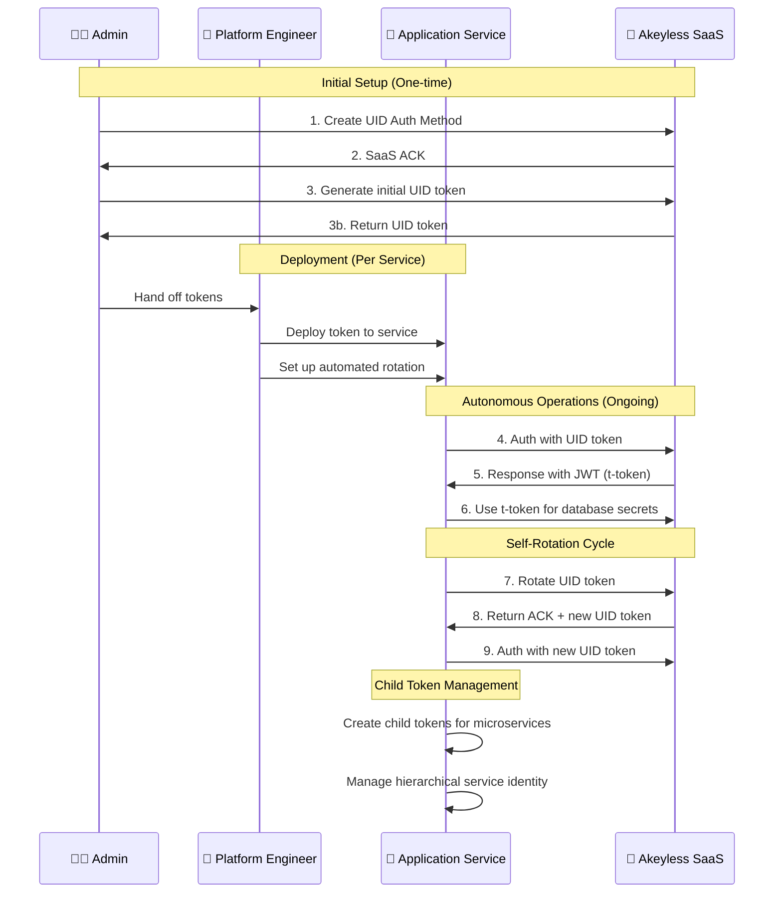

# Akeyless Universal Identity Demo

This directory contains hands-on demonstrations of Universal Identity token management capabilities following the **realistic workflow diagram personas**.

## 🎭 Persona Workflow Diagram



## 🚀 Quick Start: Persona-Based Workflow

### 🧑‍💼 Admin Persona (Steps 1-3)
```bash
# Admin sets up environment and provisions application service
./scripts/admin-setup.sh
```

### 👷 Platform Engineer Persona (Deployment)  
```bash
# Platform Engineer deploys to application services and sets up automation
./scripts/platform-deploy.sh
```

### 🚀 Application Service Persona (Steps 4-9)  
```bash
# Application Service uses deployed token for autonomous operations
./scenarios/client-workflow.sh
```

### 🔄 Legacy Demo (All-in-One - Educational Only)
```bash
# Mixed admin/client operations for learning purposes
# Note: basic-workflow.sh and setup-demo-environment.sh have been removed
# Use the persona-based approach above for realistic workflows
```

## 📋 Workflow Diagram Alignment

Our demo now properly follows the workflow diagram personas:

| Step | Persona | Action | Demo Script |
|------|---------|--------|-------------|
| 1-2 | 🧑‍💼 Admin | Creates UID Auth method + Akeyless SaaS Ack | `admin-setup.sh` |
| 3 | 🧑‍💼 Admin | Generates initial UID token & loads in application | `admin-setup.sh` |
| Deploy | 👷 Platform Engineer | Deploys token to application service + sets up automation | `platform-deploy.sh` |
| 4 | 🚀 Application Service | Runs auth command using UID init token | `client-workflow.sh` |
| 5 | 🏢 SaaS | Response with JWT (t-token) | `client-workflow.sh` |
| 6 | 🚀 Application Service | Runs commands using t-token | `client-workflow.sh` |
| 7 | 🚀 Application Service | Rotates UID using u-token | `client-workflow.sh` |
| 8 | 🏢 SaaS | Returns ACK + new u-token | `client-workflow.sh` |
| 9 | 🚀 Application Service | Runs auth command with new u-token | `client-workflow.sh` |

## 📁 Demo Structure

```
demo/
├── scripts/                       # Human persona operations
│   ├── admin-setup.sh              # 🧑‍💼 Admin persona (steps 1-3)
│   ├── platform-deploy.sh          # 👷 Platform Engineer (deployment)
│   ├── application-service-rotate.sh # 🚀 Auto-generated by platform-deploy.sh
│   ├── application-service-cron.txt  # 🚀 Cron job template
│   └── simple-rotate-token.sh      # LEGACY: Manual rotation utility
├── scenarios/                     # Application Service operations
│   ├── client-workflow.sh          # 🚀 Application Service persona (steps 4-9)
│   ├── token-rotation.sh          # 🚀 Application Service rotation demo
│   └── child-tokens.sh            # 🚀 Application Service hierarchical management
├── tokens/                        # Token storage
│   ├── client-tokens               # 🧑‍💼 Admin-generated tokens
│   ├── application-service-token   # 👷 Platform Engineer deployed tokens
│   └── demo-tokens                # LEGACY: Mixed-persona storage
├── logs/                          # Application Service logs
│   └── rotation.log               # Automated rotation logging
└── examples/                      # Implementation examples
    └── machine-auth.py            # Python application service example
```

## 🎭 Realistic Persona Workflow

### 👨‍💼 Admin Setup (One-time)

**Prerequisites:** Admin credentials required
```bash
export AKEYLESS_ACCESS_ID="your-admin-access-id"
export AKEYLESS_ACCESS_KEY="your-admin-access-key"
```

**Admin tasks:**
1. Create UID authentication method
2. Configure secrets and access policies  
3. Generate initial UID token for application service
4. Provision token to platform engineer

```bash
./scripts/admin-setup.sh
```

**Output:** `./tokens/client-tokens` file ready for platform engineer

### 👷 Platform Engineer Setup (Per Service)

**Prerequisites:** Admin-provided token file
```bash
# Token file must exist (from admin provisioning)
./tokens/client-tokens
```

**Platform Engineer tasks:**
1. Deploy tokens to application services
2. Set up automated rotation scripts
3. Configure cron jobs for hourly rotation
4. Test service authentication

```bash
./scripts/platform-deploy.sh
```

**Output:** Application service ready for autonomous operation

### 🚀 Application Service Operations (Ongoing)

**Prerequisites:** Platform Engineer deployed token file
```bash
# Token file must exist (from platform engineer deployment)
./tokens/application-service-token
```

**Application Service tasks:**
4. Authenticate using admin-provided UID token
5. Receive t-token from SaaS
6. Access database secrets using t-token
7. Self-rotate UID token
8. Receive new UID token from SaaS
9. Authenticate with new UID token

```bash
./scenarios/client-workflow.sh
```

**Key Point:** Application Service never needs admin credentials!

## 🔄 Token Rotation Scripts

### Simple Rotation (`simple-rotate-token.sh`)
**Recommended for most users** - Aligned with official Akeyless approach:

```bash
# Initialize with admin-provided token
./scripts/simple-rotate-token.sh init

# Manual rotation
./scripts/simple-rotate-token.sh rotate

# Check token status
./scripts/simple-rotate-token.sh status
```

**Features:**
- ✅ Simple init/rotate pattern
- ✅ Auto-configures hourly cron job
- ✅ Basic logging and backup
- ✅ Follows official Akeyless conventions

### Enterprise Rotation (`auto-rotate-token.sh`)
**For enterprise environments** - Advanced features:

```bash
# Run with custom config
./scripts/auto-rotate-token.sh --config /etc/akeyless/rotation-config.json
```

**Features:**
- ✅ JSON configuration files
- ✅ Webhook notifications
- ✅ Retry logic with exponential backoff
- ✅ Pre/post rotation hooks
- ✅ Comprehensive logging and monitoring
- ✅ Lock file management

## 📊 Persona Comparison

### ✅ NEW: Realistic Workflow
- **Admin** creates auth method and provisions initial token
- **Client** uses provisioned token for all operations
- Clear separation of responsibilities
- Matches production deployment patterns

### ❌ LEGACY: Mixed Operations
- Same user/script performs both admin and client operations
- Unrealistic for production environments
- Useful for learning but not for real-world deployment

## 💼 Real-World Integration Examples

### Admin Provisioning
```bash
# Admin generates token for production application
./scripts/admin-setup.sh

# Securely transfer client-tokens file to production machine
scp ./tokens/client-tokens prod-server:/secure/akeyless-token

# Remove token from admin machine
rm ./tokens/client-tokens
```

### Client Application
```python
from examples.machine_auth import AkeylessClient

# Client loads admin-provided token
client = AkeylessClient(
    auth_method_from_file="/secure/akeyless-token",
    token_file="/secure/akeyless-token"
)

# Client performs operations (no admin credentials needed)
secret = client.get_secret("/prod/database-config")
```

### Automated Client Rotation
```bash
# Client machine sets up automated rotation
./scripts/simple-rotate-token.sh init

# Cron job runs hourly (no admin involvement)
0 * * * * /path/to/simple-rotate-token.sh rotate
```

## 🎯 Next Steps

### 1. For Learning: Use Realistic Workflow
```bash
# Admin setup (once)
./scripts/admin-setup.sh

# Client operations (ongoing)
./scenarios/client-workflow.sh
```

### 2. For Production: Deploy Separately
1. **Admin**: Run `admin-setup.sh` on admin machine
2. **Transfer**: Securely move `client-tokens` to production
3. **Client**: Run `client-workflow.sh` on production machine
4. **Automate**: Set up rotation with `simple-rotate-token.sh init`

### 3. For Legacy Learning: All-in-One
```bash
# Mixed admin/client operations (educational only)
./scenarios/basic-workflow.sh
```

## 🗂️ Demo Token Storage

### NEW: Separated Token Files
- `./tokens/client-tokens` - Admin-generated, client-consumed
- `./tokens/demo-tokens` - Legacy mixed-persona storage

### Production Security
- Admin removes tokens after provisioning
- Client stores tokens with restricted permissions (600)
- Rotation happens on client machine without admin involvement

## 📚 Additional Resources

**Production Deployment Guide:** See main README.md for enterprise patterns
**Windows Integration:** [Official Akeyless Documentation](https://docs.akeyless.io/docs/setting-up-universal-identity-for-windows-machines)