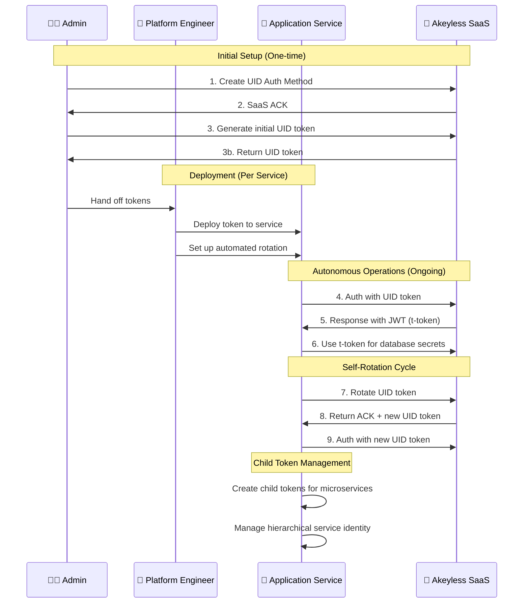

# Akeyless Universal Identity Presentation
## Solving Non-Human Identity Management

---

### Slide 1: The Non-Human Identity Challenge
**70% of Infrastructure Still Uses Static Credentials**

**The Problem:**
- Static API keys hardcoded for months/years
- Manual credential distribution and rotation
- Non-human entities (CI/CD, microservices, applications) lack proper identity
- Security breaches from compromised static secrets

**The Secret Zero Dilemma:**
- How do you securely provide the first credential to get other credentials?
- Cloud platforms (AWS/Azure/K8s) provide native identity mechanisms
- VMware, physical servers, legacy systems have NO native identity

**What We'll Demo Today:**
- Dynamic non-human identity with Universal Identity
- Live token generation, rotation, and hierarchical management
- Real secret retrieval with zero static credentials

---

### Slide 2: Universal Identity Workflow - Three Personas
**Dynamic Non-Human Identity in Action**

**Key Steps We'll Demonstrate:**
1. **Bootstrap**: Admin generates initial UID token (one-time setup)
2. **Deployment**: Platform Engineer deploys to Application Services  
3. **Authentication**: Application Service exchanges UID token → T-token  
4. **Operations**: Use T-token for database secret access
5. **Self-Rotation**: UID token rotates automatically (60-min TTL)
6. **Hierarchical Management**: Create child tokens for microservices

**"Secretless" = No static, long-lived credentials**

---

### Slide 3: Live Demo Preview - Three Realistic Personas
**What You'll See in the Demo**

**🧑‍💼 Admin Persona (Setup):**
- Create UID authentication method
- Generate initial token for Application Service
- Provision to Platform Engineer

**👷 Platform Engineer Persona (Deployment):**
- Deploy tokens to Application Services
- Set up automated rotation infrastructure
- Configure monitoring and logging

**🚀 Application Service Persona (Autonomous Operations):**
- Authenticate and retrieve database secrets
- Self-rotate tokens without human intervention
- Create child tokens for microservice components

**Key Point**: Each persona has distinct responsibilities - no credential sharing!

---

### Slide 4: Non-Human Identity Benefits - Application Services
**Why Universal Identity Transforms Security**

| Traditional Approach | Universal Identity |
|---------------------|-------------------|
| ❌ Static API keys (months/years) | ✅ Dynamic tokens (60-min TTL) |
| ❌ Manual rotation (rarely done) | ✅ Automatic self-rotation |
| ❌ Shared credentials across services | ✅ Hierarchical microservice isolation |
| ❌ Permanent exposure risk | ✅ Limited blast radius |
| ❌ Human intervention required | ✅ Zero-touch operations |

**Demo Impact**: See 90% reduction in credential management overhead

**Real-World Applications:**
- **Microservices**: Child tokens for database, API, cache services
- **Container Orchestration**: Service-specific identity management
- **CI/CD Pipelines**: Automated secret retrieval without hardcoded credentials
- **Multi-Tenant Apps**: Hierarchical tenant isolation

---

### Slide 5: Ready to Transform Non-Human Identity?
**Take Action After the Demo**

**Immediate Next Steps:**
1. **Try the Demo Yourself**: Complete GitHub repository with persona-based scenarios
2. **Pilot Universal Identity**: Start with non-production Application Services  
3. **Scale Across Infrastructure**: Implement organization-wide with Platform Engineers

**Demo Repository**: [Your-Demo-URL]

**Three-Persona Approach:**
- **Admin**: One-time setup and policy management
- **Platform Engineer**: Deployment and automation infrastructure  
- **Application Service**: Autonomous operations and microservice management

**Key Takeaway**: Non-human identity doesn't have to be a security liability. Universal Identity makes it a competitive advantage with realistic personas that match your organization.

*[Transition to live demo]*

---

## Demo Script Notes

### Opening (45 seconds)
"Today I'll show you how to eliminate static credentials from your non-human identity management using Akeyless Universal Identity. We'll follow three realistic personas - Admin, Platform Engineer, and Application Service - to go from hardcoded API keys to dynamic, self-rotating tokens with hierarchical microservice management."

### Persona Introduction (30 seconds)
"Unlike traditional demos that mix admin and client operations unrealistically, we'll follow the actual workflow your organization would use: Admin sets up authentication methods, Platform Engineers deploy to Application Services, and Application Services manage their own identity autonomously - including creating child tokens for microservices."

### Demo Transition (15 seconds)  
"Let's see this three-persona workflow in action. I'll demonstrate how each persona contributes to a complete secretless architecture that scales from simple services to complex microservice hierarchies."

### Closing (45 seconds)
"As you saw, Universal Identity transforms non-human identity from a security risk into a competitive advantage through realistic persona separation. Application Services can autonomously manage their identity and create child tokens for microservices, while Platform Engineers handle deployment automation, and Admins focus on policy. The demo repository has everything you need to implement this persona-based approach in your organization." 