# Solving Non-Human Identity Management
## Akeyless Universal Identity Presentation

---

### Slide 1: The Non-Human Identity Crisis
**70% of Infrastructure Still Uses Static Credentials**

**The Problem:**
- Static API keys hardcoded for months/years
- Manual credential distribution and rotation
- Security breaches from compromised static secrets
- Non-human entities (CI/CD, microservices, applications) lack proper identity

**The Reality:**
- Traditional identity solutions focus on humans
- Machines need 24/7 autonomous authentication
- Scale: thousands of services requiring credentials

---

### Slide 2: The Secret Zero Challenge
**The Bootstrap Dilemma**

**What is Secret Zero?**
- How do you securely provide the first credential to get other credentials?
- The paradox of needing initial credentials to retrieve credentials

**The Environment Divide:**
- ✅ **Cloud Platforms**: AWS IAM roles, Azure managed identities, K8s service accounts
- ❌ **Legacy Infrastructure**: VMware VMs, physical servers, on-premises systems
- **The Gap**: 70% of enterprise workloads lack native identity mechanisms

**Current Solutions Fall Short:**
- HashiCorp AppRole: Still requires shared `secret_id`
- Configuration files: Static secrets on disk
- Environment variables: Hardcoded credentials

---

### Slide 3: What We'll Demonstrate Today
**Dynamic Non-Human Identity in Action**

**Live Interactive Demo:**
- Real-time token generation, rotation, and hierarchical management
- Zero static credentials throughout the entire workflow
- Three realistic personas with proper separation

**Key Demonstrations:**
1. **Bootstrap Process**: Admin creates initial identity infrastructure
2. **Deployment**: Platform Engineer provisions application services
3. **Autonomous Operations**: Application Service self-manages identity with integrated token rotation
4. **Advanced Features**: Hierarchical management, Python integration

**What Makes This Different:**
- Secretless = Dynamic, auto-rotating tokens (not "no credentials")
- Realistic organizational workflow
- Production-ready patterns

---

### Slide 4: Universal Identity Workflow Overview
**Three-Persona Architecture**

```mermaid
sequenceDiagram
    participant A as 🧑‍💼 Admin
    participant P as 👷 Platform Engineer  
    participant AS as 🚀 Application Service
    participant S as 🏢 Akeyless SaaS

    Note over A,S: Initial Setup (One-time)
    A->>S: 1. Create UID Auth Method
    S->>A: 2. SaaS ACK
    A->>S: 3. Generate initial UID token
    
    Note over P,AS: Deployment (Per Service)
    A->>P: Hand off tokens
    P->>AS: Deploy token to service
    P->>AS: Set up automated rotation
    
    Note over AS,S: Autonomous Operations (Ongoing)
    AS->>S: 4. Auth with UID token → T-token
    AS->>S: 5. Use t-token for secrets
    AS->>S: 6. Self-rotate UID token
```



---

### Slide 5: Persona Separation Benefits
**Realistic Organizational Workflow**

**🧑‍💼 Admin Responsibilities:**
- Create UID authentication methods
- Generate initial tokens for services
- Maintain policy control
- One-time setup activities

**👷 Platform Engineer Responsibilities:**
- Deploy tokens to application services
- Set up automated rotation infrastructure
- Configure monitoring and logging
- Handle service provisioning

**🚀 Application Service Responsibilities:**
- Authenticate autonomously using provided tokens
- Self-rotate credentials without human intervention
- Create child tokens for microservice components
- Maintain operational security

---

### Slide 6: Interactive Demo Experience
**Try It Yourself**

**Run the Interactive Demo:**
```bash
./start.sh
```

**Choose Your Learning Path:**
- 🎯 **Complete Workflow** (Recommended for first-time users)
- 🎭 **Individual Personas** (Learn specific roles)
- 🔄 **Advanced Features** (Token rotation, hierarchical management)
- 🐍 **Python Integration** (Real-world secretless authentication)
- 📊 **Status Tracking** (Monitor workflow progress)

**Smart Features:**
- Prerequisites validation
- Dependency checking
- Progress tracking
- Color-coded interface

---

### Slide 7: Traditional vs Universal Identity
**The Transformation**

| Traditional Approach | Universal Identity |
|---------------------|-------------------|
| ❌ Static API keys (months/years) | ✅ Dynamic tokens (60-min TTL) |
| ❌ Manual rotation (rarely done) | ✅ Automatic self-rotation |
| ❌ Shared credentials across services | ✅ Hierarchical microservice isolation |
| ❌ Permanent exposure risk | ✅ Limited blast radius |
| ❌ Human intervention required | ✅ Zero-touch operations |
| ❌ Break-glass scenarios complex | ✅ Granular revocation controls |

**Key Insight:** 90% reduction in credential management overhead

---

### Slide 8: Real-World Applications
**Where Universal Identity Excels**

**Microservices Architecture:**
- Child tokens for database, API, cache services
- Different TTLs for different risk levels
- Service-to-service authentication

**Container Orchestration:**
- Kubernetes pods with service-specific identity
- No hardcoded secrets in container images
- Dynamic credential injection

**CI/CD Pipelines:**
- Automated secret retrieval without static credentials
- Pipeline-specific token scoping
- Secure deployment automation

**Multi-Tenant Applications:**
- Hierarchical tenant isolation
- Dynamic credential provisioning
- Scalable identity management

---

### Slide 9: Live Demo Scenarios
**What You'll Experience**

**Scenario 1: Complete Three-Persona Workflow**
- Admin setup → Platform deployment → Application operations
- End-to-end secretless authentication
- Zero static credentials

**Scenario 2: Token Rotation**
- Automatic 60-minute rotation within client-workflow.sh
- Seamless operation continuity
- Old token invalidation

**Scenario 3: Hierarchical Management**
- Parent-child token relationships
- Microservice isolation
- Granular revocation

**Scenario 4: Python Integration**
- Real-world application patterns
- Developer-friendly integration
- Production-ready examples

---

### Slide 10: Next Steps - Try It Now
**Immediate Actions**

**1. Experience the Demo:**
```bash
./start.sh
```
- Interactive menu-driven experience
- Choose complete workflow or individual steps
- Learn at your own pace

**2. Implementation Path:**
- **Pilot**: Start with non-production services
- **Scale**: Implement across infrastructure
- **Integrate**: Use Python patterns in your applications

**3. Production Deployment:**
- Phased rollout approach
- Monitor and validate
- Scale organization-wide

---

### Slide 11: Transform Your Security Posture
**Ready to Eliminate Static Credentials?**

**Key Takeaway:** Non-human identity doesn't have to be a security liability. Universal Identity makes it a competitive advantage.

**What You Get:**
- ✅ Secretless architecture with dynamic credentials
- ✅ Zero human intervention after setup
- ✅ Hierarchical organization matching your infrastructure
- ✅ Production-ready integration patterns
- ✅ Interactive learning experience

**Demo Repository**: [Your-Demo-URL]

**The Question:** Not whether to modernize, but how quickly you can eliminate static credentials.

*[Transition to live interactive demo]*

---

## Demo Script Notes

### Opening (30 seconds)
"Non-human identity is the largest security challenge most organizations ignore. Today I'll show you how to eliminate static credentials completely using Akeyless Universal Identity. We'll follow three realistic personas through an interactive demo that you can try yourself."

### Problem Setup (45 seconds)
"70% of infrastructure still uses static API keys that never rotate. The secret zero problem - how do you securely provide the first credential - has plagued every automated system. Cloud platforms solved this for their services, but what about VMware VMs, physical servers, and legacy systems? That's where Universal Identity transforms the game."

### Demo Transition (30 seconds)  
"Let's see this transformation in action. I'll use our interactive demo that you can run yourself - just execute start.sh and choose your learning path. We'll experience the complete workflow from admin setup through autonomous application operations."

### Value Demonstration (60 seconds)
"As you saw, we went from static credentials that never change to dynamic tokens that auto-rotate every 60 minutes. The application service never needs admin credentials, can self-rotate without human intervention, and creates child tokens for microservice isolation. This is secretless architecture in practice."

### Closing (30 seconds)
"Universal Identity transforms non-human identity from a security risk into a competitive advantage. Try the interactive demo yourself - the start.sh script guides you through each scenario. The patterns work across any infrastructure: containers, VMs, physical servers, CI/CD pipelines. The future is secretless, and you can start building it today." 